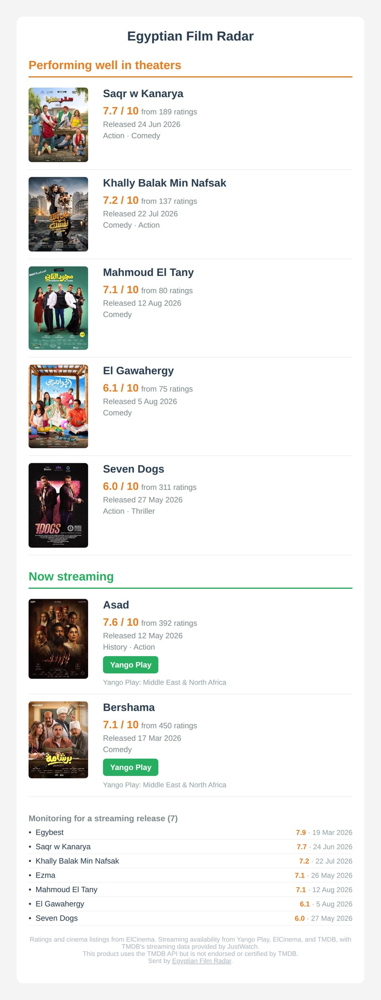

# Egyptian Film Radar

Get an email when a new Egyptian movie is doing well in cinemas, and another when it starts streaming.

Egyptian Film Radar checks ElCinema every week for Egyptian movies in Egyptian cinemas, follows their ratings for their first few weeks, and emails you the ones that pass your bar. It then keeps watching those movies and tells you as soon as one shows up on a streaming service, anywhere in the world: Yango Play, Netflix, Shahid, OSN+, STARZPLAY, TOD, Prime Video and more.

It runs on your own computer or NAS with Docker, and emails you every two weeks.

<p align="center">
  
</p>

## What you get

Each email has two sections:

- **Performing well in theaters**: new Egyptian movies whose ElCinema rating reached your minimum, sorted by rating, with release date and genre.
- **Now streaming**: movies from the first section that just became available to stream, with a button for each service and where it's available.

At the bottom is a short list of the movies it's still monitoring for a streaming release.

Every movie is reported once. You won't get the same movie twice in the same section.

## How it works

1. **Cinemas.** It reads ElCinema's "Now Playing in Egypt" list and keeps the Egyptian movies. Re-released classics and foreign films are skipped.
2. **Ratings.** A new movie gets re-checked every run for a few weeks (4 by default), because ElCinema ratings move a lot in the first weeks. Once it reaches your minimum rating with enough votes, it goes in the next email.
3. **Streaming.** Every movie that made the cut gets checked every run against three sources:
   - **Yango Play**, read directly from its public list of titles
   - **TMDB**, which has JustWatch's streaming data for Netflix, Shahid, OSN+, STARZPLAY, TOD, Prime Video and many others, in every country
   - **ElCinema's own streaming links**, the only source that sometimes has WATCH IT
4. **Email.** Every two weeks it sends whatever is new. If nothing is new, it sends a short "nothing new" email so you know it's still running.

## What you need

- **Docker** with Docker Compose (on a NAS, a home server, or any computer that's on when it runs). You can also run it with plain Python 3.10+; see [Running without Docker](#running-without-docker).
- **An email account that can send mail from scripts.** For Gmail, that means an [App Password](https://myaccount.google.com/apppasswords) (requires 2-step verification). Most other providers work too; see [Settings](#settings).
- **A free TMDB API key** (strongly recommended). Without it, only Yango Play and ElCinema are checked for streaming. [Create an account](https://www.themoviedb.org/signup), then go to Settings → API and request a key (choose "Developer" and "Personal"). Use the 32-character **API Key**, not the long "Read Access Token".

## Setup

**1. Download the project.** Click the green **Code** button at the top of this page and choose **Download ZIP**, then unzip it where you want it to live. Or, with git:

```bash
git clone https://github.com/YoussefElnaka/egyptian-film-radar.git
cd egyptian-film-radar
```

**2. Create your settings file.** Copy `.env.example` to a new file named `.env` in the same folder, and fill in at least `EMAIL_ADDRESS`, `EMAIL_PASSWORD`, `TO_EMAIL` and `TMDB_API_KEY`. Every setting is explained inside the file.

**3. Create a folder named `data`** in the project folder. This is where the script keeps its memory. (Docker creates it automatically on most systems, but Synology and some others refuse to, so it's safest to create it yourself.)

**4. Do a practice run.** This builds the container and runs everything except sending the email. The email is saved to `data/preview.html` instead, so you can open it in a browser:

```bash
docker compose build
docker compose run --rm -e DRY_RUN=1 egyptian-film-radar
```

> The **first run takes 20–30 minutes**, because it reads about 1,000 Yango Play pages once to build its title list. It saves that list, so later runs take a few minutes.

**5. Send a test email.** Test mode sends the real email with `[TEST]` in the subject, but saves nothing, so you can run it as often as you like:

```bash
docker compose run --rm -e TEST_MODE=1 egyptian-film-radar
```

**6. Do the first real run:**

```bash
docker compose run --rm egyptian-film-radar
```

**7. Schedule it weekly.** Run it once a week. It keeps track of when it last sent an email and skips the weeks in between on its own (every 14 days by default). That way, if your machine happens to be off on newsletter day, the email just goes out the next week.

With cron on Linux or macOS (`crontab -e`), for every Monday at 9:00:

```cron
0 9 * * 1 cd /path/to/egyptian-film-radar && docker compose build -q && docker compose run --rm egyptian-film-radar >> data/run.log 2>&1
```

Replace `/path/to/egyptian-film-radar` with the real folder.

### Synology NAS

1. Put the project folder in your `docker` shared folder, for example `/volume1/docker/egyptian-film-radar`, and create the `data` folder inside it with File Station.
2. Open **Control Panel → Task Scheduler → Create → Scheduled Task → User-defined script**.
3. **General** tab: name it `Egyptian Film Radar`, user `root`.
4. **Schedule** tab: weekly, on the day and time you want.
5. **Task Settings** tab, in the **Run command** box:

   ```bash
   cd /volume1/docker/egyptian-film-radar && docker-compose build && docker-compose run --rm egyptian-film-radar
   ```

6. To read the output of each run, open Task Scheduler's **Settings**, tick **Save output results**, and pick a folder. Then use **Action → View Result** on the task.

For a test run on Synology, make a second task with `-e TEST_MODE=1` added after `--rm`, leave it disabled, and run it by hand.

## Settings

All settings live in `.env`. Changes take effect on the next run, with no rebuild needed.

| Setting | Default | What it does |
|---|---|---|
| `EMAIL_ADDRESS` | *(required)* | The account that sends the email. |
| `EMAIL_PASSWORD` | *(required)* | Its password. For Gmail and most providers, an app password. |
| `TO_EMAIL` | *(required)* | Who receives it. Several people: separate with commas, no spaces. |
| `SMTP_HOST` | `smtp.gmail.com` | Your provider's outgoing mail server. |
| `SMTP_PORT` | `587` | `587` for STARTTLS (most providers) or `465` for SSL. |
| `SMTP_USER` | same as `EMAIL_ADDRESS` | Only if your provider's login differs from your email address. |
| `TMDB_API_KEY` | *(empty)* | Needed to check Netflix, Shahid, OSN+ and similar services. |
| `MIN_RATING` | `6.0` | Minimum ElCinema rating (out of 10) to count as performing well. |
| `MIN_VOTES` | `20` | Ignore ratings based on fewer votes than this. |
| `RECHECK_WEEKS` | `4` | How long to keep re-checking a new movie's rating. |
| `STREAMING_WATCH_MONTHS` | `12` | How long to wait for a streaming release before giving up on a movie. |
| `RUN_EVERY_DAYS` | `14` | Send at most once every this many days. |
| `SHOW_ARABIC_TITLES` | `false` | Show each movie's Arabic title under the English one. |

## Test mode and dry runs

| | Sends email | Saves anything | Use it to |
|---|---|---|---|
| `-e DRY_RUN=1` | No, writes `data/preview.html` | No | Check the setup and preview the email |
| `-e TEST_MODE=1` | Yes, with `[TEST]` in the subject | No | Check that email sending works |
| *(neither)* | Yes | Yes | Normal runs |

Test and dry runs ignore the every-two-weeks rule. Normal runs within two weeks of the last email just print when the next one is due and stop.

The Yango Play title list (`data/yango_index.json`) is saved in every mode, since it's only a lookup list.

## Files it creates

Everything is in the `data` folder:

- `state.json`: what it remembers, including movies being followed, the streaming watchlist, and what's been reported. Delete it to start completely fresh.
- `yango_index.json`: the saved Yango Play title list. Safe to delete; it's rebuilt on the next run (which will be slow again).
- `preview.html`: the last dry-run email.

## Running without Docker

```bash
pip install -r requirements.txt
python newsletter.py
```

Put your `.env` file next to `newsletter.py`; the script reads it automatically. The `data` folder is created next to the script. `DRY_RUN=1` and `TEST_MODE=1` work as environment variables, for example `DRY_RUN=1 python newsletter.py`.

## Limitations

- **It only knows what its sources know.** If a movie isn't in ElCinema's cinema listings, it won't be picked up.
- **WATCH IT is hit or miss.** WATCH IT blocks automated visitors and isn't tracked by JustWatch, so the only source is ElCinema's occasional WATCH IT links.
- **Yango Play is Middle East & North Africa only**, so a Yango release may not be watchable where you live. TMDB results show the countries for each service.
- **Movies that go straight to streaming** without a cinema release aren't included.
- **Websites change.** If ElCinema or Yango Play redesigns its pages, the script may stop finding things until it's updated. The email shows a red warning when that seems to have happened, for example when it finds zero movies in cinemas.

## Credits

- Ratings, cinema listings, release dates and posters: [ElCinema](https://elcinema.com)
- Yango Play availability: [Yango Play](https://play.yango.com)
- Streaming availability for other services: [TMDB](https://www.themoviedb.org), with data provided by [JustWatch](https://www.justwatch.com)

<a href="https://www.themoviedb.org"></a>

This product uses the TMDB API but is not endorsed or certified by TMDB.

Egyptian Film Radar is an independent project. It is not affiliated with or endorsed by ElCinema, Yango Play, TMDB, JustWatch, or any streaming service. It reads public pages politely, with pauses between requests and a user agent that links back to this project.

## License

[MIT](LICENSE)
